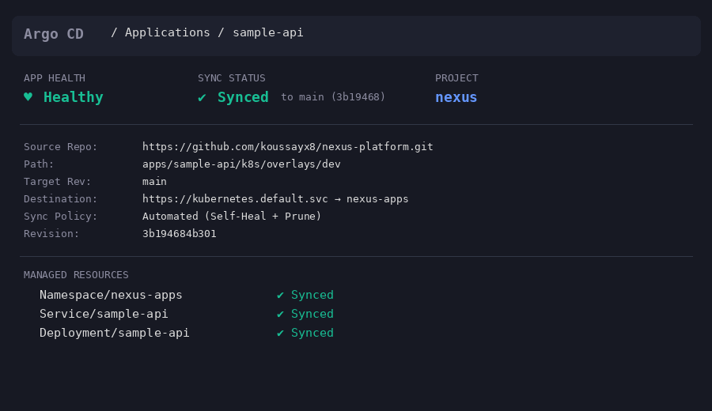
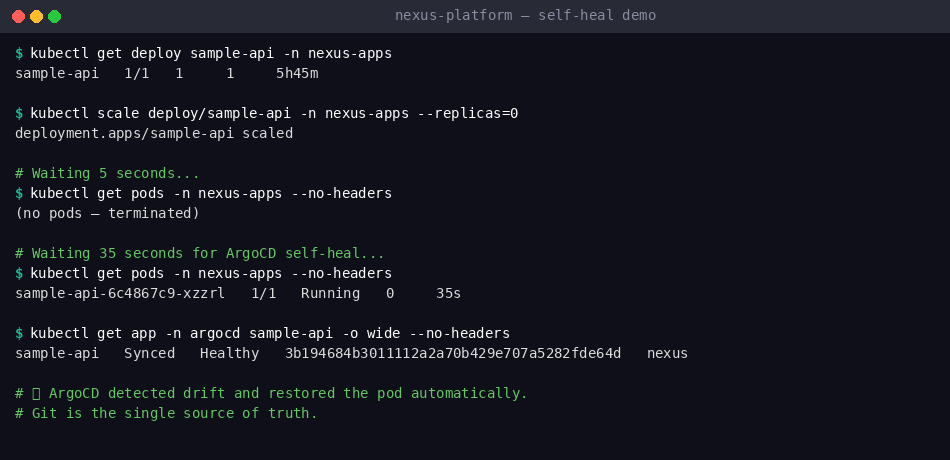
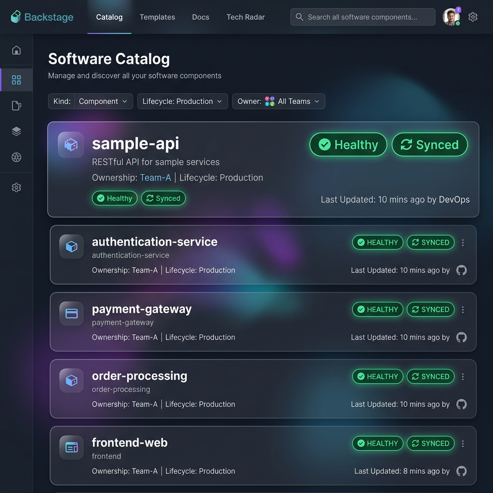

# NEXUS — AI-Native Internal Developer Platform

[](https://github.com/koussayx8/nexus-platform/actions/workflows/ci.yml)

**PFE Project — Engineering Thesis**
**Author:** Koussay Belhouchet — ESPRIT
**Duration:** 24 weeks

## What NEXUS Is

A Kubernetes-native Internal Developer Platform implementing
closed-loop AIOps principles. Combines developer self-service
(Backstage + Crossplane + ArgoCD), DevSecOps automation
(Vault + Kyverno + Cosign), and AI-driven incident response
(LSTM anomaly detection + LangChain agent + kopf operator).

## Research Contribution

Three-way anomaly detection comparison (Z-score vs Isolation Forest vs LSTM)
and LLM-based incident reasoning operator — measured via controlled
chaos engineering experiments with reproducible benchmark packs.

## Key Architecture Decisions

- **GitOps Strategy** — ArgoCD with auto-sync, self-heal, and pruning. Git is the single source of truth ([ADR-004](docs/ADR-004-gitops-strategy.md))
- **Autonomy Ladder** — Five-level trust model (Observe → Diagnose → Recommend → Approve → Auto-Heal) for graded AI autonomy, enforced by Kyverno policy ([ADR-003](docs/ADR-003-autonomy-ladder.md))
- **Incident Flight Recorder** — Immutable audit trail for every AI decision ([ADR-009](docs/ADR-009-incident-flight-recorder.md))
- **Security-hardened CI** — Ruff + Semgrep + GitLeaks + Trivy + Cosign ([ADR-002](docs/ADR-002-ci-pipeline-design.md))

## Stack

| Layer | Technology |
|-------|------------|
| IDP | Backstage + Crossplane + ArgoCD |
| GitOps | ArgoCD (auto-sync + self-heal + prune) |
| Policy | Kyverno v1.18.0 (Autonomy Ladder enforcement) |
| Security | Vault + Kyverno + Cosign + Falco |
| Observability | OpenTelemetry + Grafana Cloud |
| AI | Groq Llama 70B + LSTM + ChromaDB |
| Infra | k3s (dev) + DigitalOcean DOKS (prod) |
| CI/CD | GitHub Actions + GHCR + Trivy + Cosign |

## Repository Structure

```
nexus-platform/
├── apps/
│   └── sample-api/             # FastAPI service (CI/CD validation)
│       ├── k8s/base/           # Kustomize base (Deployment + Service)
│       ├── k8s/overlays/dev/   # Dev overlay (k3s-optimized)
│       ├── main.py             # Health/ready endpoints
│       ├── Dockerfile          # Multi-stage, hardened
│       └── test_main.py        # Pytest suite
├── platform/
│   ├── argocd/applications/    # ArgoCD Application manifests
│   └── kyverno/policies/       # Kyverno ClusterPolicies
├── infra/                      # Infrastructure (k3s, Terraform)
├── ai/                         # AI components (agent, anomaly-detector, RAG)
├── docs/                       # ADRs + validation logs
└── .github/workflows/          # CI pipeline
```

## GitOps Workflow

```
Git push to main
    │
    ▼
CI Pipeline (lint → test → SAST → secrets → build → scan → sign)
    │
    ▼
Image pushed to ghcr.io (SHA-pinned digest)
    │
    ▼
ArgoCD detects change (auto-sync, 3-min poll)
    │
    ▼
Kustomize rendered → K8s resources applied
    │
    ▼
Kyverno validates (nexus.io/autonomy-level: 0-4)
    │
    ▼
Pod running, self-heal enabled (manual changes reverted)
```

**Self-heal proven:** `kubectl scale --replicas=0` → ArgoCD restores within 40s.







See [full validation log](docs/gitops-validation-log.md) for details.

## Status

- [x] Week 0 — Environment setup (k3s, ArgoCD, API keys, venv)
- [x] Week 1 — CI pipeline + sample-api deployed to k3s
- [x] Week 2 — ArgoCD GitOps + Kyverno policy enforcement
- [x] Week 3 — Backstage IDP
- [ ] ...

## Quick Start (Dev)

```bash
# ArgoCD manages everything — no manual kubectl apply needed
# To check status:
kubectl get app -n argocd sample-api
kubectl get pods -n nexus-apps
kubectl get policyreport -n nexus-apps

# ArgoCD UI (port-forward):
kubectl port-forward svc/argocd-server -n argocd 8080:443
# Login: admin / $(kubectl get secret -n argocd argocd-initial-admin-secret -o jsonpath='{.data.password}' | base64 -d)

# Backstage Setup
cd platform/backstage
yarn install
yarn start
```
